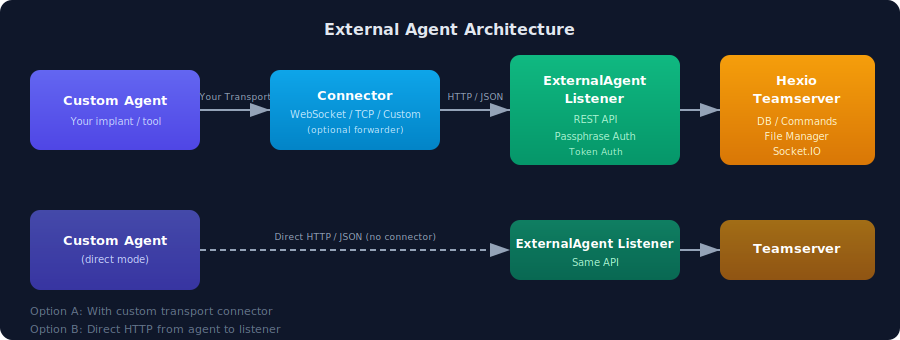
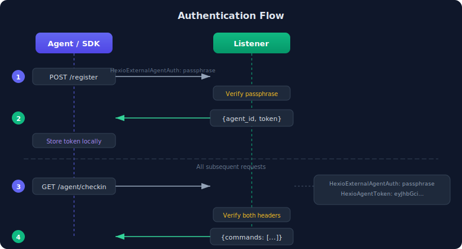
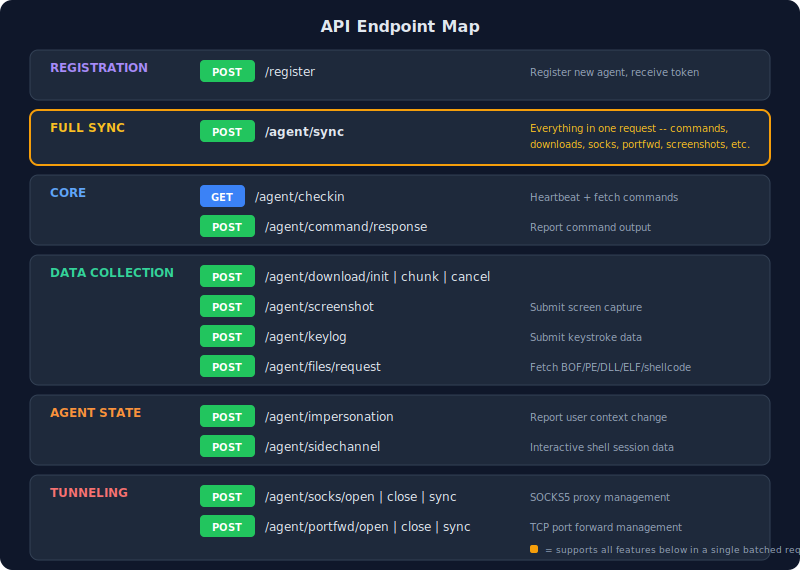
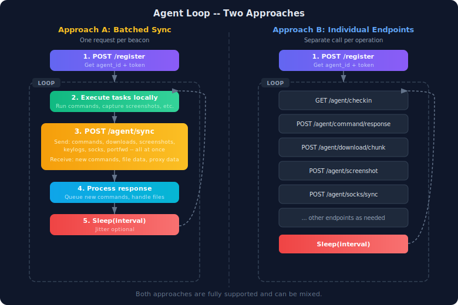

# Hexio External Agent REST API Specification

The External Agent API allows operators to build custom agents and connectors that interact with the Hexio C2 teamserver. This REST API exposes all core C2 functionality through a simple JSON-based interface, enabling fully custom tradecraft while retaining access to the Hexio teamserver's command queuing, file management, SOCKS proxying, port forwarding, loot collection, and companion client UI.

## Architecture



Your custom agent can connect directly to the ExternalAgent Listener, or you can place a connector/forwarder in between that translates your own transport protocol (WebSocket, DNS, ICMP, etc.) into HTTP/JSON calls against the listener.

## Authentication



All requests require the `HexioExternalAgentAuth` header containing the passphrase configured when the External Agent listener was created. After registration, all `/agent/*` endpoints additionally require the `HexioAgentToken` header.

| Header | Where Required | Description |
|--------|----------------|-------------|
| `HexioExternalAgentAuth` | **All** requests | Listener passphrase |
| `HexioAgentToken` | `/agent/*` routes only | Agent auth token (returned by `/register`) |
| `Content-Type` | POST requests | `application/json` |

### Error Responses

All errors return JSON:

```json
{ "error": "description of what went wrong" }
```

| Status | Meaning |
|--------|---------|
| `400` | Invalid request body / malformed JSON |
| `401` | Missing or invalid passphrase / agent token |
| `404` | Resource not found (agent, proxy, port forward) |
| `500` | Server-side failure |

---

## Endpoint Map



---

## Agent Lifecycle



---

## Two Integration Approaches

You have two ways to interact with the API. Choose whichever fits your agent architecture:

### Approach A: Batched Sync (Recommended for production)

Use `POST /agent/sync` as your single endpoint. Pack everything into one request per beacon -- command results, downloads, SOCKS data, screenshots, etc. The response contains everything the agent needs: new commands, file requests, proxy data. This minimizes round trips, which matters for high-latency or covert transports.

```
loop:
    POST /agent/sync  { commands: [...], download_chunk: [...], socks_sync: {...} }
    <-- { commands: [...], socks_sync: {...}, bof_files: {...} }
    sleep(interval)
```

### Approach B: Individual Endpoints (Simpler, good for development)

Use each endpoint separately. Easier to debug and understand, but more HTTP requests per beacon cycle.

```
loop:
    GET  /agent/checkin
    POST /agent/command/response  (for each completed command)
    POST /agent/download/chunk    (for each file chunk)
    POST /agent/socks/sync        (if proxy active)
    sleep(interval)
```

Both approaches are fully supported and can even be mixed.

---

## Endpoint Reference

### POST /register

Register a new external agent with the teamserver. This is the first call your agent or connector makes.

> **Auth:** `HexioExternalAgentAuth` only (no agent token yet)

**Request:**

```json
{
    "hostname": "WORKSTATION-01",
    "ip": "10.0.0.50",
    "user": "admin",
    "os": "Windows 10 Pro",
    "arch": "x64",
    "process": "myagent.exe",
    "pid": 4832,
    "client_type": "my_custom_agent",
    "sleep_time": 5
}
```

| Field | Type | Required | Description |
|-------|------|----------|-------------|
| `hostname` | string | yes | Target machine hostname |
| `ip` | string | yes | Target IP address |
| `user` | string | yes | Running user context |
| `os` | string | yes | Operating system description |
| `arch` | string | yes | Architecture of the process |
| `process` | string | yes | Process name the agent is running in |
| `pid` | int64 | yes | Process ID |
| `client_type` | string | yes | Must match your `client_type.json` name |
| `sleep_time` | int64 | no | Beacon interval in seconds (default: 0) |

**Response `200`:**

```json
{
    "agent_id": 1,
    "token": "eyJhbGciOiJIUz..."
}
```

Save the `token` value. All subsequent `/agent/*` calls require it in the `HexioAgentToken` header.

---

### GET /agent/checkin

Simple heartbeat. Returns any pending commands and staged files. Updates the agent's last callback timestamp.

**Response `200`:**

```json
{
    "commands": [
        { "id": 42, "command": "whoami" },
        { "id": 43, "command": "ps" }
    ],
    "files": [ ]
}
```

The `commands` array contains operator-queued commands. Each has an `id` you must reference when returning results via `/agent/command/response`.

---

### POST /agent/sync

Full bidirectional sync. This is the **power endpoint** -- it supports every operation in a single request, letting you batch command responses, file downloads, screenshots, SOCKS traffic, port forward data, and more into one HTTP call. If the body is empty, behaves identically to `/agent/checkin`.

> **Two approaches:** You can either use `/agent/sync` for everything (batched, fewer round-trips, ideal for high-latency transports), or use the individual endpoints below for each operation separately (simpler, easier to debug). Both work -- pick what fits your agent's design.

**Request -- all fields are optional, include only what you need:**

```json
{
    "sleep": {
        "sleep_time": 10,
        "sleep_jitter": 3
    },
    "impersonation": "DOMAIN\\HighPrivUser",
    "commands": [
        {
            "command_id": 42,
            "command": "whoami",
            "response": "nt authority\\system"
        }
    ],
    "side_channel_responses": [
        {
            "channel_id": "shell-1",
            "data": "<base64 encoded>"
        }
    ],
    "download_init": [
        {
            "file_name": "secrets.db",
            "agent_path": "/tmp/secrets.db",
            "file_size": 4096,
            "chunk_size": 4096,
            "total_chunks": 1
        }
    ],
    "download_chunk": [
        {
            "download_id": "abc-123",
            "chunk_data": "<base64 encoded>"
        }
    ],
    "download_cancel": ["def-456"],
    "screenshots": [
        {
            "filename": "screen.png",
            "data": "<base64 encoded>"
        }
    ],
    "keylog": {
        "filename": "keys.txt",
        "data": "keystroke data"
    },
    "bof_files": ["whoami.o"],
    "pe_files": ["mimikatz.exe"],
    "dll_files": [],
    "elf_files": [],
    "macho_files": [],
    "shellcode_files": [],
    "hexlang": [],
    "socks_open": {},
    "socks_open_port": 1080,
    "socks_close": {},
    "socks_sync": {
        "closes": ["sockid1"],
        "receives": [
            { "id": "sockid1", "data": "<base64>" }
        ]
    },
    "portfwd_open": [
        { "port": 8080, "remote_host": "10.0.0.5", "remote_port": 3389 }
    ],
    "portfwd_close": [8080],
    "portfwd_sync": [
        {
            "port": 8080,
            "data": {
                "opens": ["sockid1"],
                "sends": [
                    { "sockid": "sockid1", "data": "<base64>", "size": 1234 }
                ],
                "closes": ["sockid2"]
            }
        }
    ]
}
```

| Field | Type | Description |
|-------|------|-------------|
| `sleep` | object | Update beacon interval (`sleep_time`) and jitter (`sleep_jitter`) |
| `impersonation` | string | Report user context change; empty string clears it |
| `commands` | array | Command execution results (`command_id`, `command`, `response`) |
| `side_channel_responses` | array | Side channel output (`channel_id`, `data`) |
| `download_init` | array | Start file downloads (same fields as `/agent/download/init`) |
| `download_chunk` | array | File chunks (`download_id`, `chunk_data` as base64) |
| `download_cancel` | array | Download IDs to cancel |
| `screenshots` | array | Screenshot submissions (`filename`, `data` as base64) |
| `keylog` | object | Keylog data (`filename`, `data`) |
| `bof_files` | array | BOF filenames to fetch from teamserver |
| `pe_files` | array | PE filenames to fetch |
| `dll_files` | array | DLL filenames to fetch |
| `elf_files` | array | ELF filenames to fetch |
| `macho_files` | array | Mach-O filenames to fetch |
| `shellcode_files` | array | Shellcode filenames to fetch |
| `hexlang` | array | HexLang profile names to fetch |
| `socks_open` | object | Open a SOCKS5 proxy (presence of key triggers open; empty `{}` is fine) |
| `socks_open_port` | int64 | Optional: specific port for the SOCKS proxy |
| `socks_close` | object | Close the SOCKS5 proxy (presence of key triggers close) |
| `socks_sync` | object | SOCKS proxy data from agent: `{ closes: [sockid], receives: [{ id, data }] }`. `data` is base64. |
| `portfwd_open` | array | Open port forwards: `[{ port, remote_host, remote_port }]` |
| `portfwd_close` | array | Teamserver ports to close (e.g. `[8080]`) |
| `portfwd_sync` | array | Per-port forward data from agent: `[{ port, data: { opens: [sockid], sends: [{ sockid, data, size }], closes: [sockid] } }]`. `data` in `sends` is base64. |

**Response `200` -- includes everything the agent needs:**

```json
{
    "commands": [
        { "id": 43, "command": "ps" }
    ],
    "files": [
        {
            "filename": "beacon.dll",
            "filetype": "dll",
            "alias": "beacon",
            "filedata": "<base64>"
        }
    ],
    "download_init": [
        { "agent_path": "/tmp/secrets.db", "download_id": "abc-123" }
    ],
    "download_chunk": [
        { "download_id": "abc-123", "chunk_received": true }
    ],
    "bof_files":       { "whoami.o":    "<base64>" },
    "pe_files":        { "mimikatz.exe": "<base64>" },
    "dll_files":       { "mylib.dll":   "<base64>" },
    "elf_files":       { "portscanner": "<base64>" },
    "macho_files":     { "dykit":       "<base64>" },
    "shellcode_files": { "injectme.bin":"<base64>" },
    "hexlang":         { "socketio-masking": "<base64>" },
    "socks_open": true,
    "socks_port": 1080,
    "socks_close": true,
    "socks_sync": {
        "opens": [
            { "id": "sockid1", "addr": "1.2.3.4", "port": 80, "proto": "tcp" }
        ],
        "closes": ["sockid2"],
        "send": [
            { "id": "sockid1", "data": "<base64>", "size": 1234 }
        ]
    },
    "portfwd_open":  [ { "port": 8080, "success": true } ],
    "portfwd_close": [ { "port": 8080, "success": true } ],
    "portfwd_sync": [
        {
            "port": 8080,
            "data": {
                "recvs": [
                    { "sockid": "sockid1", "data": "<base64>", "size": 1234 }
                ],
                "closes": ["sockid2"]
            }
        }
    ]
}
```

Only fields relevant to your request are included in the response.

**Response field reference:**

| Field | Type | Notes |
|-------|------|-------|
| `commands` | array | Queued commands: `[{ id, command }]`. Always present (possibly empty). |
| `files` | array | Staged file uploads for the agent: `[{ filename, filetype, alias, filedata }]`. Omitted if none staged. `filedata` is base64. |
| `download_init` | array | Acknowledgement of `download_init` requests: `[{ agent_path, download_id }]`. |
| `download_chunk` | array | Acknowledgement of chunk uploads: `[{ download_id, chunk_received }]`. |
| `bof_files` / `pe_files` / `dll_files` / `elf_files` / `macho_files` / `shellcode_files` / `hexlang` | object | Map of requested filename to base64 bytes. Filenames that couldn't be resolved are omitted. |
| `socks_open` | bool | Whether the SOCKS proxy was opened this sync. |
| `socks_port` | int64 | Teamserver port that was bound (only when `socks_open` is `true`). |
| `socks_close` | bool | Whether the SOCKS proxy was closed this sync. |
| `socks_sync` | object | SOCKS data for the agent: `{ opens: [{ id, addr, port, proto }], closes: [sockid], send: [{ id, data, size }] }`. `data` is base64. Note: the field is `send` (singular). |
| `portfwd_open` | array | Per-port open result: `[{ port, success }]`. |
| `portfwd_close` | array | Per-port close result: `[{ port, success }]`. |
| `portfwd_sync` | array | Per-port forward data for the agent: `[{ port, data: { recvs: [{ sockid, data, size }], closes: [sockid] } }]`. `data` inside `recvs` is base64. |

---

### POST /agent/command/response

Report the result of a command execution.

**Request:**

```json
{
    "command_id": 42,
    "command": "whoami",
    "response": "nt authority\\system"
}
```

| Field | Type | Required | Description |
|-------|------|----------|-------------|
| `command_id` | int64 | yes | The `id` from the command received via checkin |
| `command` | string | yes | The command string that was executed |
| `response` | string | yes | Full command output |

**Response `200`:** `{ "status": "ok" }`

---

### POST /agent/download/init

Begin a file download (exfiltration) from the target to the teamserver. Call this first, then send chunks via `/agent/download/chunk`.

**Request:**

```json
{
    "file_name": "credentials.db",
    "agent_path": "C:\\Users\\admin\\AppData\\credentials.db",
    "file_size": 524288,
    "chunk_size": 65536,
    "total_chunks": 8
}
```

**Response `200`:**

```json
{
    "download_id": "abc123-uuid",
    "agent_path": "C:\\Users\\admin\\AppData\\credentials.db"
}
```

### POST /agent/download/chunk

Send a file chunk for an active download.

**Request:**

```json
{
    "download_id": "abc123-uuid",
    "chunk_data": "<base64 encoded chunk bytes>"
}
```

**Response `200`:** `{ "status": "ok" }` or `{ "status": "complete" }` when all chunks received.

### POST /agent/download/cancel

Cancel an active download.

**Request:** `{ "download_id": "abc123-uuid" }`

**Response `200`:** `{ "status": "ok" }`

---

### POST /agent/screenshot

Submit a screenshot capture.

**Request:**

```json
{
    "filename": "screenshot_2024_01_15.png",
    "data": "<base64 encoded image bytes>"
}
```

**Response `200`:** `{ "status": "ok" }`

---

### POST /agent/keylog

Submit keylogger data.

**Request:**

```json
{
    "filename": "keylog_2024_01_15.txt",
    "data": "captured keystrokes data here"
}
```

**Response `200`:** `{ "status": "ok" }`

---

### POST /agent/impersonation

Report a user impersonation change (e.g., after token impersonation or runas).

**Request:**

```json
{ "user": "DOMAIN\\HighPrivUser" }
```

Send an empty string to clear: `{ "user": "" }`

**Response `200`:** `{ "status": "ok" }`

---

### POST /agent/sidechannel

Send side channel data (interactive shell sessions, etc.).

**Request:**

```json
{
    "channel_id": "shell-session-1",
    "data": "<base64 encoded output>"
}
```

**Response `200`:** `{ "status": "ok" }`

---

### POST /agent/files/request

Request files from the teamserver's library. Only include the file types you need, all fields are optional.

**Request:**

```json
{
    "bof_files": ["whoami.o"],
    "pe_files": ["mimikatz.exe"],
    "dll_files": ["payload.dll"],
    "elf_files": ["linpeas"],
    "macho_files": ["agent_macos"],
    "shellcode_files": ["beacon.bin"],
    "hexlang": ["default_profile"]
}
```

**Response `200`:**

```json
{
    "bof_files": { "whoami.o": "<base64 encoded>" },
    "pe_files": { "mimikatz.exe": "<base64 encoded>" }
}
```

Files not found are silently omitted from the response map.

---

### POST /agent/socks/open

Open a SOCKS5 proxy on the teamserver, tunneled through this agent.

**Request (optional):** `{ "port": 1080 }` -- if omitted, the teamserver assigns a port.

**Response `200`:** `{ "status": "ok", "port": 1080 }`

### POST /agent/socks/close

Close the SOCKS5 proxy for this agent.

**Response `200`:** `{ "status": "ok" }`

### POST /agent/socks/sync

Exchange SOCKS proxy data. Your agent/connector polls this to shuttle traffic.

**Request/Response:** Inbound/outbound SOCKS data structures.

---

### POST /agent/portfwd/open

Create a port forward.

**Request:**

```json
{
    "port": 8080,
    "remote_host": "10.0.0.100",
    "remote_port": 3389
}
```

**Response `200`:** `{ "status": "ok" }`

### POST /agent/portfwd/close

Close a port forward.

**Request:** `{ "port": 8080 }`

**Response `200`:** `{ "status": "ok" }`

### POST /agent/portfwd/sync

Exchange port forward data for all active forwards.

**Request:** Array of `{ "port": int64, "data": string }` entries.

**Response:** Array of `{ "port": int64, "data": string }` entries to forward back.

---

## Client Type Configuration

External agents must provide a `client_type.json` file that the teamserver loads and shares with companion clients. The filename (without `.json`) must match the `client_type` field inside.

**Example: `dotnet.json`**

```json
{
    "client_type": "dotnet",
    "client_commands": {
        "shell": {
            "description": "Execute a shell command",
            "usage": "shell <command>",
            "detailed": "Executes the given command via cmd.exe /c and returns stdout/stderr.\n\nExamples:\n  shell whoami\n  shell dir C:\\Users"
        },
        "download": {
            "description": "Download a file from the target",
            "usage": "download <remote_path>",
            "detailed": "Downloads the specified file from the target machine to the teamserver.\n\nExamples:\n  download C:\\Users\\admin\\Desktop\\secrets.txt"
        }
    },
    "supported_features": [
        "download",
        "upload",
        "screenshot",
        "keylog",
        "socks",
        "portfwd"
    ]
}
```

### Supported Features

| Feature | Description | API Endpoints |
|---------|-------------|---------------|
| `download` | File exfiltration | `/agent/download/*` |
| `upload` | File upload to target | Via staged files in `/agent/checkin` |
| `screenshot` | Screen capture | `/agent/screenshot` |
| `keylog` | Keystroke logging | `/agent/keylog` |
| `sidechannel` | Interactive sessions | `/agent/sidechannel` |
| `socks` | SOCKS5 proxy tunneling | `/agent/socks/*` |
| `portfwd` | TCP port forwarding | `/agent/portfwd/*` |

---

## SDK Libraries

Pre-built SDK libraries are provided for quick integration:

| Language | Location | Install |
|----------|----------|---------|
| **Go** | [`go/`](go/) | `go get` the module |
| **Python** | [`python/`](python/) | `pip install hexio-sdk` |
| **C++** | [`cpp/`](cpp/) | CMake `install` or copy the single header |
| **Rust** | [`rust/`](rust/) | Add as a `Cargo.toml` path/git dependency |
| **C# / .NET** | [`csharp/`](csharp/) | `dotnet add reference` or `dotnet pack` + NuGet |
| **TypeScript / JS** | [`typescript/`](typescript/) | `npm install` (Node 18+, Bun, Deno, browsers) |
| **Java** | [`java/`](java/) | `mvn install`, then Maven / Gradle dependency |

See each SDK's README for detailed usage, examples, and installation instructions.

---

## HexioScript Integration

External agents expose two fields to HexioScript:

- `self.agent_type` (string) -- The `client_type` from registration
- `self.agent_external` (bool) -- Always `true` for external agents

Use these to write custom HexioScript commands:

```python
if self.agent_external and self.agent_type == "dotnet":
    # Custom logic for your .NET agent
    pass
```
